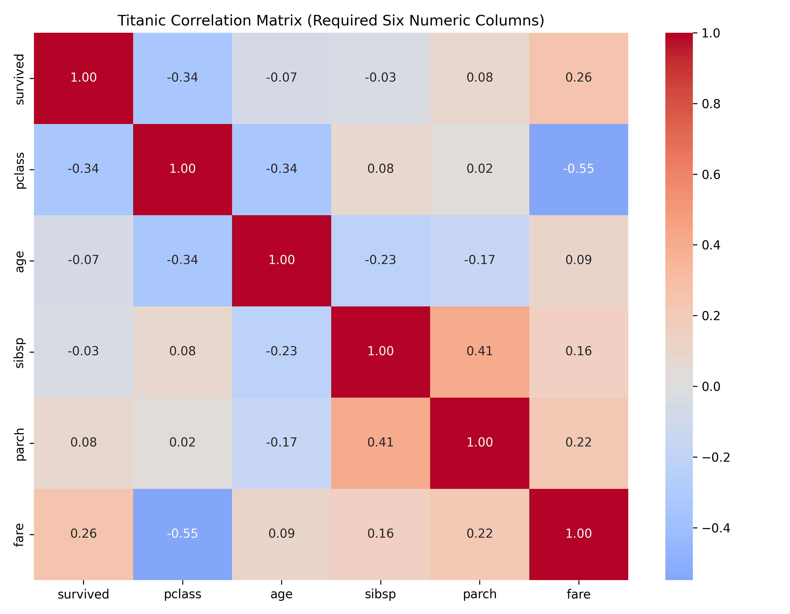
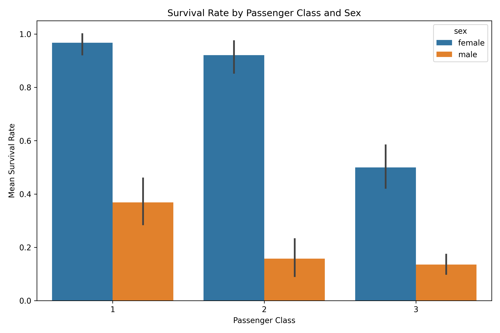
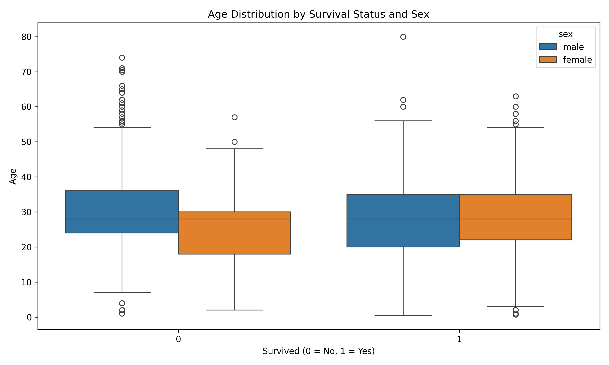
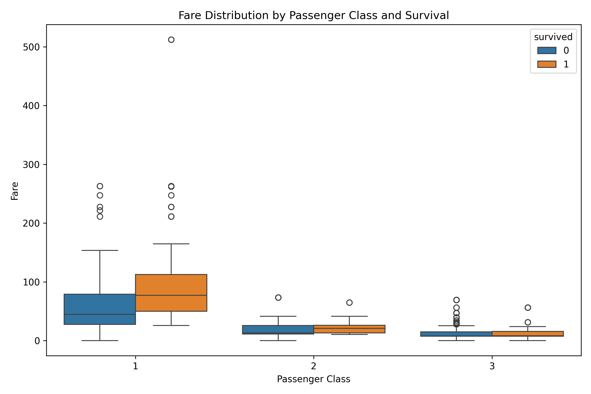
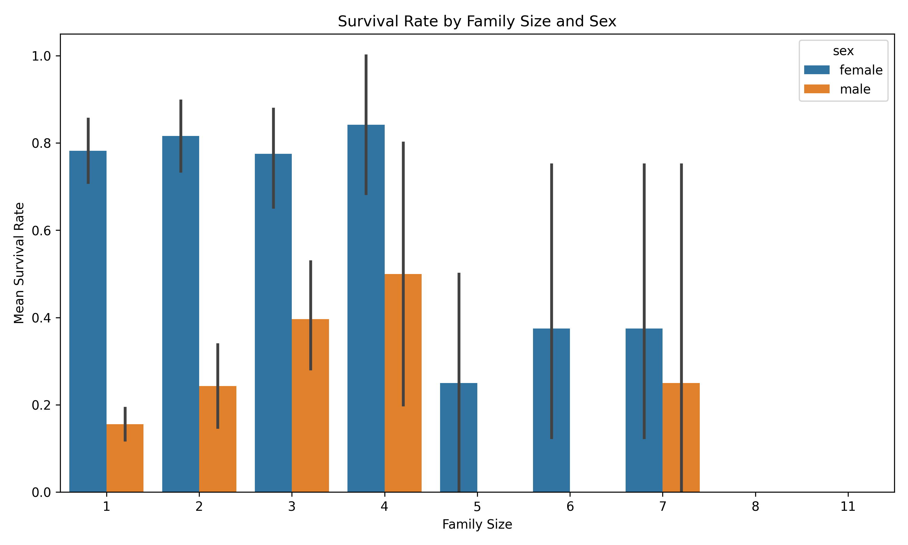
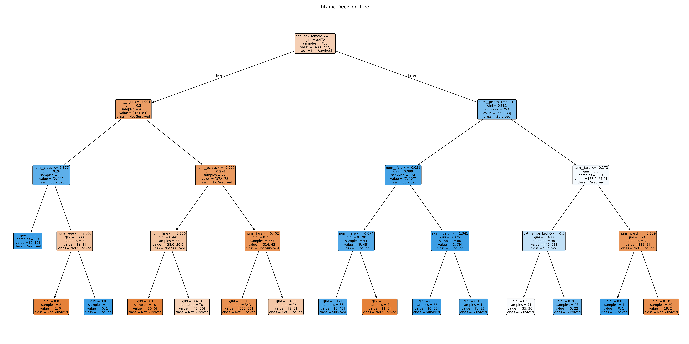
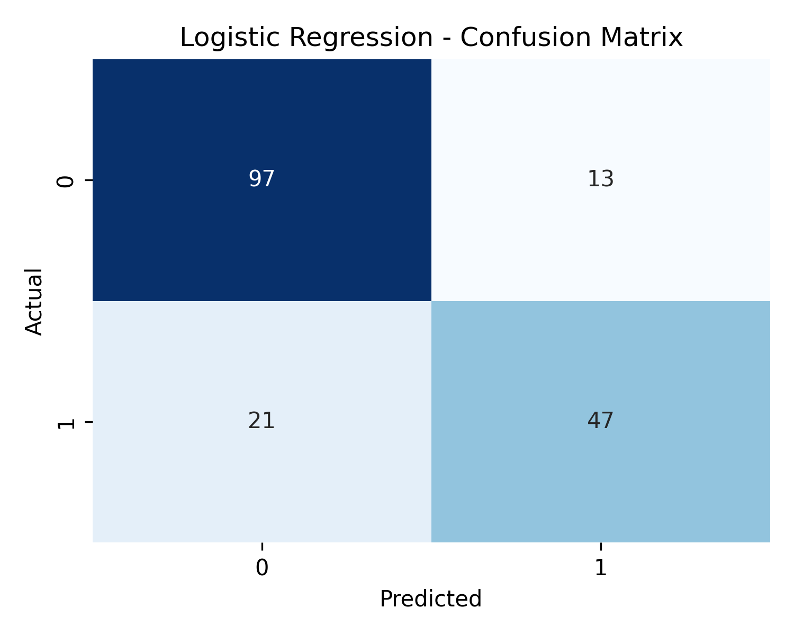
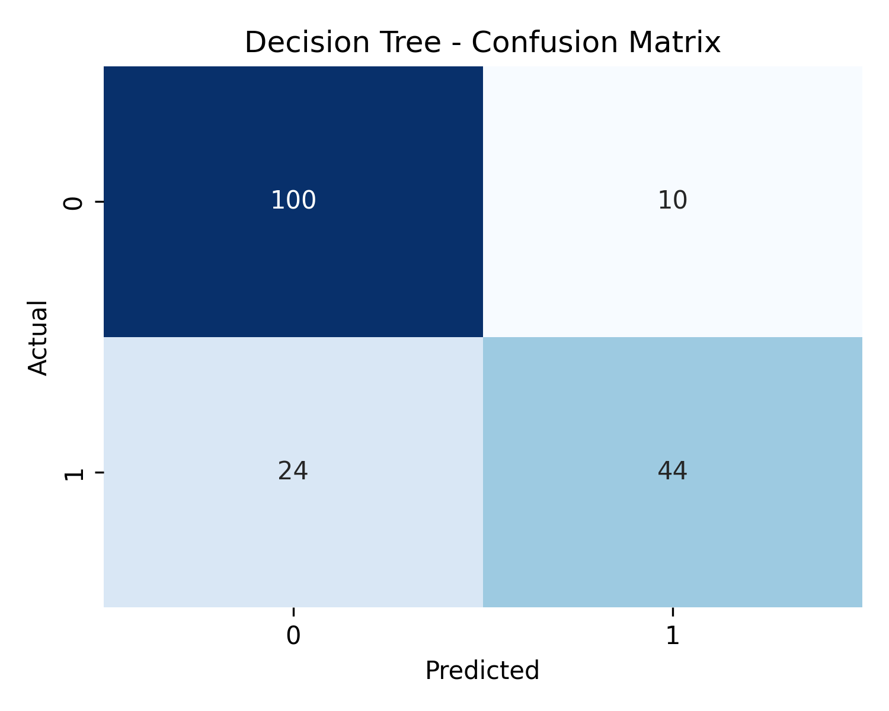
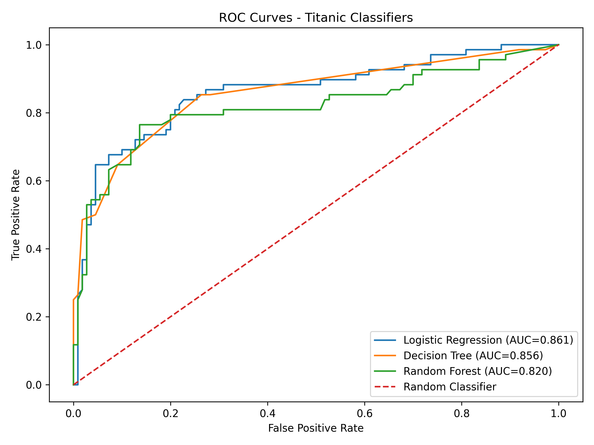
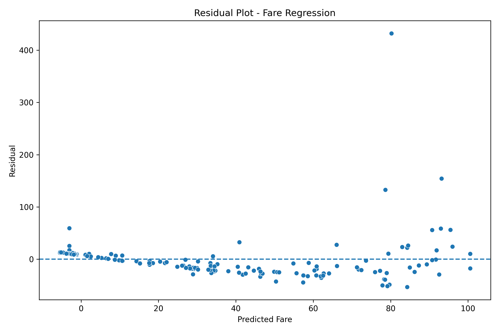

# 🚢 Titanic Survival Analytics & Predictive Modeling Pipeline

An end-to-end machine learning pipeline built on the classic Titanic dataset covering data cleaning, exploratory data analysis, multivariate storytelling, classification, class-imbalance handling, hyperparameter tuning, regression, and model persistence, all wrapped in a single reproducible notebook.

This project was built to demonstrate production-style ML workflow habits: leakage-safe preprocessing, justified data-cleaning decisions, multi-model benchmarking, and a saved, reloadable inference pipeline not just a notebook of disconnected plots.

---

## 📌 Project Highlights

- **Leakage-free preprocessing** : all imputation, scaling, and encoding are fit exclusively on training data inside `sklearn` Pipelines, never on the full dataset.
- **Justified missing-data strategy** : every column's missing-value treatment (drop rows / impute / drop column) is decided programmatically based on missingness thresholds (< 5%, 5–30%, > 30%).
- **Three benchmarked classifiers** : Logistic Regression, Decision Tree, and Random Forest compared on Accuracy, Precision, Recall, F1, and ROC-AUC.
- **Class imbalance handling** : baseline vs. `class_weight="balanced"` vs. SMOTE oversampling, compared fairly (SMOTE applied only to training folds).
- **Hyperparameter tuning** : `GridSearchCV` (5-fold CV, F1-optimized) over Random Forest depth, estimators, and feature sampling, with out-of-bag (OOB) score reported.
- **Regression side-task** : a multivariate Linear Regression model predicting `fare`, evaluated with MAE, RMSE, R², and Adjusted R², including residual diagnostics for heteroscedasticity.
- **Model persistence** : the best-performing complete pipeline (preprocessing + estimator) is serialized with `joblib` and verified to reproduce identical predictions on raw, unprocessed input after reloading.

---

## 🧰 Tech Stack

| Category | Tools |
|---|---|
| Language | Python 3 |
| Data Handling | pandas, numpy |
| Visualization | matplotlib, seaborn |
| Machine Learning | scikit-learn |
| Imbalanced Data | imbalanced-learn (SMOTE) |
| Model Persistence | joblib |

---

## 📂 Project Structure

```
├── titanic_analysis.ipynb          # Main pipeline notebook
├── titanic.csv                     # Raw dataset (seaborn's built-in Titanic data)
├── best_titanic_pipeline.joblib    # Saved, reloadable end-to-end model pipeline
├── charts/                         # All generated visualizations
│   ├── correlation_heatmap.png
│   ├── survival_sex_class.png
│   ├── survival_age.png
│   ├── fare_survival.png
│   ├── family_survival.png
│   ├── decision_tree.png
│   ├── *_confusion_matrix.png
│   ├── roc_curves.png
│   └── regression_residuals.png
└── outputs/                        # Metric tables (CSV)
    ├── model_comparison.csv
    ├── imbalance_comparison.csv
    └── regression_metrics.csv
```

---

## 🔍 Workflow Overview

### 1. Data Loading & Inspection
Loads the Titanic dataset via `seaborn.load_dataset`, exports a raw CSV snapshot, and inspects shape, dtypes, and descriptive statistics.

### 2. Missing Value Handling
A rules-based strategy determines the treatment for every column:
- **< 5% missing** → drop affected rows (`embarked`, `embark_town`)
- **5–30% missing** → median imputation (`age`)
- **> 30% missing** → drop column entirely (`deck`)

### 3. Bivariate & Correlation Analysis
Survival rates are broken down by sex, passenger class, and their combination using boolean masking, alongside a 6×6 correlation matrix (`survived`, `pclass`, `age`, `sibsp`, `parch`, `fare`) visualized as a heatmap.



The strongest relationships: **pclass and fare** are negatively correlated (-0.55, higher class number means lower fare), and **survived and pclass** are also negatively correlated (-0.34) first-class passengers survived at noticeably higher rates.

### 4. Multivariate Data Story

**Survival by Sex & Class** : women survived at dramatically higher rates than men across every class, and survival for both sexes improves in higher classes:



**Age Distribution by Survival & Sex** : age distributions of survivors and non-survivors overlap substantially, meaning age alone is a weak predictor without other context:



**Fare Distribution by Class & Survival** : fare is closely tied to class, and survivors are concentrated among higher-fare passengers, especially in first class:



**Survival by Family Size & Sex** : survival doesn't increase monotonically with family size; small-to-mid-sized families fare better than solo travelers or very large groups:



### 5. Train/Test Split & Preprocessing
A stratified 80/20 split preserves class proportions. Numeric features are median-imputed and scaled; categorical features are mode-imputed and one-hot encoded all inside a `ColumnTransformer` fit only on training data.

### 6. Classification Modeling
Three classifiers (Logistic Regression, Decision Tree, Random Forest) are trained inside identical preprocessing pipelines and evaluated on held-out test data.



**Confusion Matrices**

| Logistic Regression | Decision Tree | Random Forest |
|---|---|---|
|  |  |  |

**ROC Curves**



### 7. Class Imbalance Handling
Three strategies were compared on the Logistic Regression model baseline, `class_weight="balanced"`, and SMOTE oversampling (fit only on training folds, never on test data):

| Strategy | Precision | Recall | F1 |
|---|---|---|---|
| Baseline | 0.783 | 0.691 | 0.734 |
| Class Weight Balanced | 0.718 | 0.750 | 0.734 |
| SMOTE | 0.735 | 0.735 | 0.735 |

All three strategies land within a hair of each other on F1 (~0.734), but they trade precision for recall differently. The baseline is most precise when it predicts survival; class weighting catches the most true survivors (highest recall); SMOTE lands right in between with the most balanced precision/recall split.

### 8. Hyperparameter Tuning
`GridSearchCV` tunes the Random Forest across estimators, depth, and feature sampling strategy using 5-fold cross-validation optimized for F1, with OOB score reported as an additional validation signal.

### 9. Regression Side-Task
A Linear Regression model predicts `fare` from passenger attributes (class, age, family size, sex, embarkation port, and survival status):

| Model | MAE | RMSE | R² | Adjusted R² |
|---|---|---|---|---|
| Multiple Linear Regression | 21.10 | 41.70 | 0.348 | 0.309 |

The model explains about **35% of the variance** in fare expected, since fare in this era was driven heavily by cabin/berth specifics not captured in these features. The residual plot below shows increasing spread at higher predicted fares, consistent with mild heteroscedasticity:



### 10. Final Comparison & Model Persistence
All classification and regression metrics are consolidated into a single comparison table. The best-performing pipeline is saved with `joblib` and reloaded to confirm it reproduces identical predictions directly from raw input proving the artifact is deployment-ready.

---

## 📊 Final Results

**Classification** (test set, from `outputs/model_comparison.csv`):

| Model | Accuracy | Precision | Recall | F1 | AUC |
|---|---|---|---|---|---|
| Logistic Regression | 0.809 | 0.783 | 0.691 | 0.734 | **0.861** |
| Decision Tree | 0.809 | **0.815** | 0.647 | 0.721 | 0.856 |
| Random Forest | 0.809 | 0.766 | **0.721** | **0.742** | 0.820 |

All three models converge on ~81% accuracy, but differ in trade-offs: **Decision Tree** is the most precise when predicting survival, **Random Forest** catches the most true survivors (best recall and F1), and **Logistic Regression** has the strongest overall class separation (best AUC) making it the most reliable, interpretable baseline for this dataset.

**Regression** (predicting fare):

| Model | MAE | RMSE | R² | Adjusted R² |
|---|---|---|---|---|
| Multiple Linear Regression | 21.10 | 41.70 | 0.348 | 0.309 |

**Key takeaway:** sex, passenger class, and fare are the strongest predictors of survival, while age alone shows limited discriminative power without multivariate context.

---

## ▶️ How to Run

```bash
# 1. Clone the repository
git clone <your-repo-url>
cd <your-repo-name>

# 2. Install dependencies
pip install pandas numpy matplotlib seaborn scikit-learn imbalanced-learn joblib

# 3. Run the notebook
jupyter notebook titanic_analysis.ipynb
```

The notebook is self-contained: it creates its own `charts/` and `outputs/` directories, downloads the dataset, and runs the full pipeline end to end.

---

## 🧠 Skills Demonstrated

- Data cleaning with quantitatively justified decisions
- Leakage-safe pipeline design with `sklearn.pipeline.Pipeline` and `ColumnTransformer`
- Handling imbalanced classification targets (class weighting, SMOTE)
- Model selection via cross-validated hyperparameter search
- Both classification and regression modeling in one workflow
- Model serialization and integrity verification for deployment readiness
- Clear, business-readable data storytelling through visualization

---

## 📄 License

This project is available under the MIT License, feel free to fork, adapt, and build on it.

---

## 👤 Author

Built as a portfolio project to showcase applied machine learning and data science engineering practices. Feel free to reach out via GitHub or LinkedIn for questions or collaboration.
